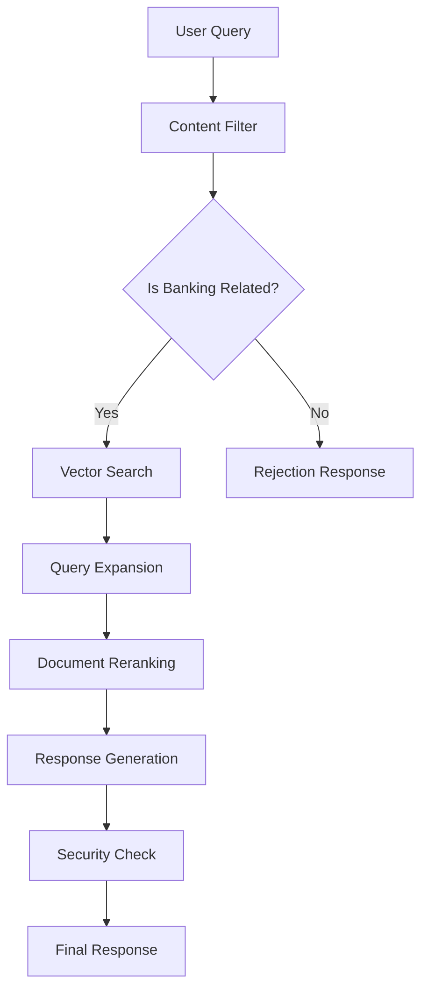

# Azure OpenAI Banking Assistant with Advanced Guardrails 🏦

A comprehensive, secure banking assistant powered by Azure OpenAI services with multiple layers of guardrails and security features.


## 📝 Table of Contents

- [Overview](#overview)
- [Key Features](#key-features)
- [Architecture](#architecture)
- [Security Features](#security-features)
- [Components](#components)
- [Installation](#installation)
- [Usage](#usage)
- [Configuration](#configuration)

## 🎯 Overview

This system implements a secure banking assistant with multiple layers of protection:

- Content filtering
- Vector-based guardrails
- Keyword-based security
- Advanced NeMo guardrails
- Document reranking

## 🔑 Key Features

- **Multi-layer Security** 
    - Content validation
    - Query filtering
    - Access control
    - Information protection

- **Smart Document Retrieval**
    - Vector search
    - Query expansion
    - Document reranking

- **Advanced Guardrails**
    - Banking content validation
    - Sensitive info protection
    - Unauthorized access prevention

## 🏗️ Architecture



## 🔒 Security Features

1. **Content Filtering**
     - Banking relevance check
     - Sensitive information detection
     - Access control validation

2. **Information Protection**
     - PII data protection
     - Account info security
     - Credential protection

## 🧩 Components

| Component | Purpose |
|-----------|---------|
| AzureConfig | Configuration management |
| Content Filter | Query validation |
| Vector Store | Document retrieval |
| Guardrails | Security enforcement |
| Reranking | Result optimization |

## 💻 Installation

```bash
# Clone repository
git clone https://github.com/subrata-samanta/chatbot-guardrails

# Install dependencies
pip install -r requirements.txt

# Configure environment
cp .env.example .env
```

## 🚀 Usage

```python

print(final_guardrails_chain.invoke({
    "question": "How can I apply for a loan?",
    "chat_history": [
        {"role": "user", "content": "How to check my bank balance?"}, 
        {"role": "assistant", "content": "To check your account balance, you can log in to the online banking portal or use the mobile banking app."}
    ]
}))

```

## ⚙️ Configuration

1. Set up Azure OpenAI credentials in `.env`:
```
AZURE_ENDPOINT=<your-endpoint>
AZURE_API_KEY=<your-api-key>
```

2. Configure model deployments:
```python
config = AzureConfig(
        chat_model="gpt-4",
        embedding_model="text-embedding-3-large"
)
```

